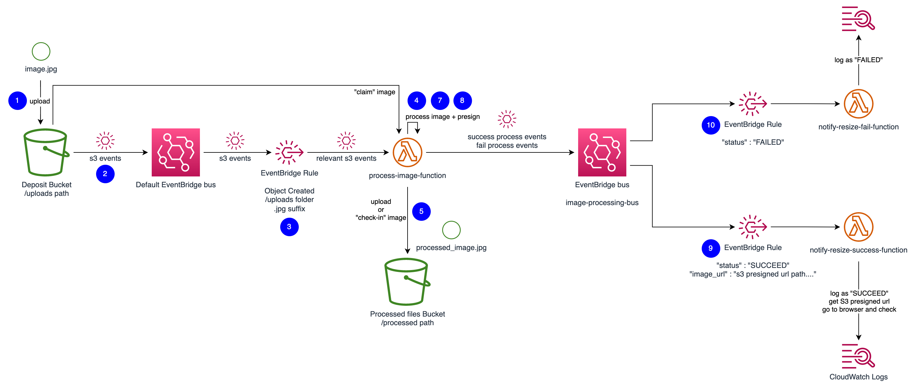
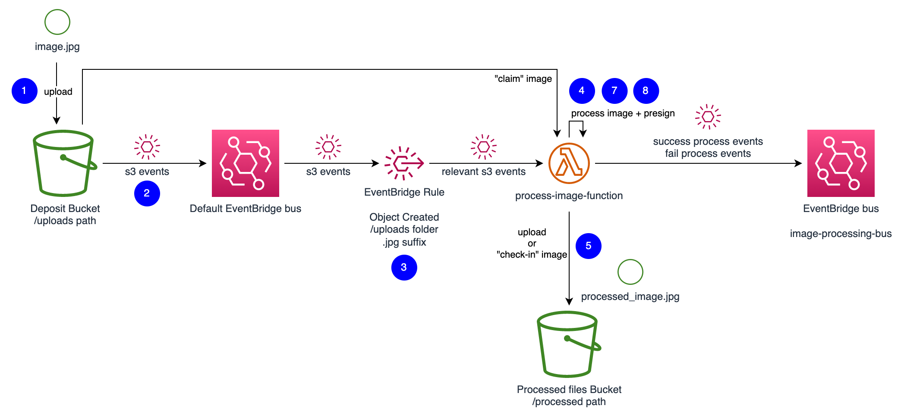
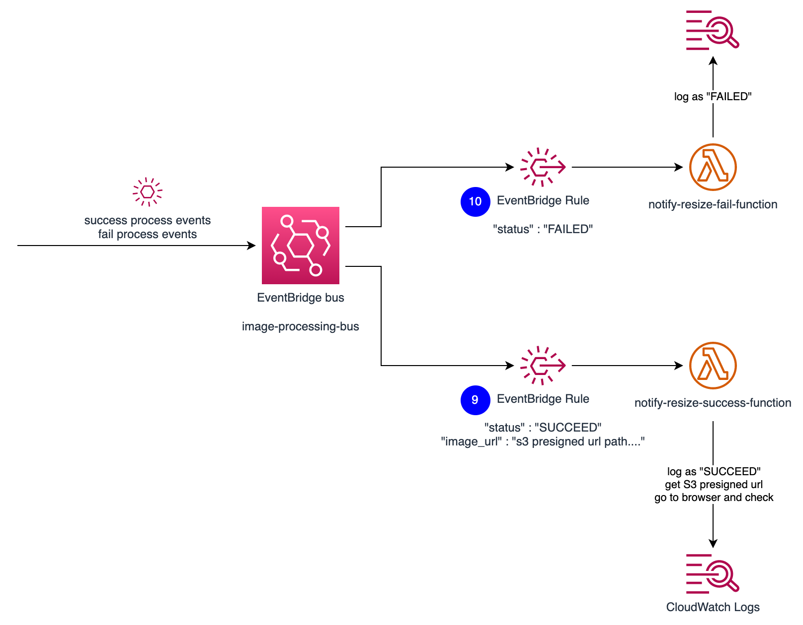

# Assignment2
## Amazon Web Services, Level 5
### Unitec Institute of Technology
AWS re/Start, October 2023 - February 2024

- [Rules](#rules)
- [Part I. System architecture and system design (30 marks total)](#part-i-system-architecture-and-system-design-30-marks-total)
  - [Part I.1. (5/30 marks)](#part-i1-530-marks)
  - [Part I.2. (5/30 marks)](#part-i2-530-marks)
  - [Part I.3. (5/30 marks)](#part-i3-530-marks)
  - [Part I.4. (5/30 marks)](#part-i4-530-marks)
  - [Part I.5. (5/30 marks)](#part-i5-530-marks)
  - [Part I.6. (5/30 marks)](#part-i6-530-marks)
- [Part II. Classic AWS Architecture design (30 marks total)](#part-ii-classic-aws-architecture-design-30-marks-total)
  - [Part II.1. - Base design questions (20/30 marks)](#part-ii1---base-design-questions-2030-marks)
  - [Part II.2. - Expansive network design questions (10/30 marks)](#part-ii2---expansive-network-design-questions-1030-marks)
  - [Part II.3. - Bonus design questions (bonus 5 marks)](#part-ii3---bonus-design-questions-bonus-5-marks)
- [Part III. AWS Native Architecture design (10 marks total)](#part-iii-aws-native-architecture-design-10-marks-total)
- [Part IV. AWS Native Software Development (30 marks total)](#part-iv-aws-native-software-development-30-marks-total)
  - [Part IV.1. Setup source events (10/30 marks)](#part-iv1-setup-source-events-1030-marks)
  - [Part IV.2. Checking in (10/30 marks)](#part-iv2-checking-in-1030-marks)
  - [Part IV.3. Making a claim (10/30 marks)](#part-iv3-making-a-claim-1030-marks)
  - [Part IV.4. Bonus mark for quality (5 bonus mark)](#part-iv4-bonus-mark-for-quality-5-bonus-mark)


# Rules

- Its ok to discuss strategy/solution between each other, just don't copy work
- Don't make it obvious that you have copied unmodified contents from the AI tools/Stackoverflow
- Don't ask the tutors to give you the answer, though you may ask for hints/high level how
- Feel free to ask the tutors to get you fix an execution time error/environment setup fault
- Feel free let us know during class if you find something is wrong with the assignment questions
- Be reasonable with the tutors' time, so everyone can have a turn at asking them for help

# Part I. System architecture and system design (30 marks total)

These are the research based questions, in short-answer questions form. Each question is expecting 150-300 words for answers for each sub part (I.1., I.2....). Attachment of images, and reference links are encouraged.

Please use `Part I` folder to contain your answers in `markdown files`

References:
- [Serverless land](https://serverlessland.com/event-driven-architecture/visuals)
- [Enterprise Integration Pattern](https://www.enterpriseintegrationpatterns.com/)
- [System design primer](https://github.com/donnemartin/system-design-primer)

## Part I.1. (5/30 marks)

- Explain eventual and strong consistency
- Which AWS persistent services/feature should you expect eventual consistency?
- Which AWS persistent services/feature should you expect strong consistency?
- Name some (2-3) usecases where eventually consistent persistences are acceptable

Answer in file `Part I/Part I.1.md`

## Part I.2. (5/30 marks)

- Explain the need for messaging integration
- Why should we use message brokers in microservices architecture?
- Find AWS architecture references for the use of message broker in microservices.

Answer in file `Part I/Part I.2.md`

## Part I.3. (5/30 marks)

- Explain the differences between point-to-point messaging pattern (Queue) and publish/subscribe pattern (Pub/Sub)
- When would you use point-to-point messaging over the other?
- When would you use publish/subscribe over the other?
- Find AWS architecture references for point-to-point messaging
- Find AWS architecture references for publish/subscribe

Answer in file `Part I/Part I.3.md`

## Part I.4. (5/30 marks)

- Explain idempotency in the context of transactional processing
- What does it mean to have an idempotent consumer?
- Given SQS as the message broker, and Lambda function as the message consumer
  - How would you implement Lambda as an idempotent consumer?
  - Which component would become the bottleneck when you implement idempotent consumers?

Answer in file `Part I/Part I.4.md`

## Part I.5. (5/30 marks)

- What is Change Data Capture (CDC)? 
- What is CDC useful for? 
- Which additional architecture patterns can CDC enable?
- Find AWS architecture references for the use of CDC
  - Transactional Processing
  - Analytics Processing

Answer in file `Part I/Part I.5.md`

## Part I.6. (5/30 marks)

- Given a simple AWS EC2 in a Auto Scaling Group architecture with ALB and a dedicated DB instance, name 5 system design components/techniques that can help you scale your system to meet more end-customers demand. Hinted layers:
  - Static content cache
  - Dynamic content cache
  - Compute distribution
  - Persistency
  - Decoupling methods
- For each component, explain in few words (other than adding complexity), what are the trade offs of introducing these components if they weren't added before

Answer in file `Part I/Part I.6.md`

# Part II. Classic AWS Architecture design (30 marks total)

Research, design, draw figures and find ways to improve the existing architecture. You will be expected to produce detailed infrastructure and network flow design.

References:
- [AWS NWFW for centralized Egress](https://docs.aws.amazon.com/whitepapers/latest/building-scalable-secure-multi-vpc-network-infrastructure/using-nat-gateway-with-firewall.html)
- [AWS NWFW for centralized Ingress](https://docs.aws.amazon.com/whitepapers/latest/building-scalable-secure-multi-vpc-network-infrastructure/using-network-firewall-for-centralized-ingress.html)
- [All inspection models for AWS Network Firewall](https://d1.awsstatic.com/architecture-diagrams/ArchitectureDiagrams/inspection-deployment-models-with-AWS-network-firewall-ra.pdf)

Expected submission formats are:
- Graphics files `.drawio` or exported `.png` in high resolution.
- Any notes and long form answers to be placed in file `Part II/Answer.md`
- It is encourged to reference to `.png` images inside file `Part II/Answer.md`

Given information:
- The entire CIDR range of the VPC is `10.0.0.0/16`
- There are 3 AZs to be used for the VPC
- Each Subnets tiers will span across all same 3 AZs
- There are 5 VPC tiers from top to bottom
  - Public subnets with AWS Network Firewall `Firewall Tier`.
  - Public subnets but protected by AWS Network Firewall where AWS ALB and NATGW sit `Protected Tier`.
  - Private subnets `Multi-Purpose Tier` where different EC2 workloads called `services/microservices` are managed by AutoScalingGroup, load balanced by ALB from the tier above.
  - Private subnets `Secure Tier` where RDS, EFS and other AWS Managed databases reside
  - Private subbets `Management Tier` where few EC2 jump host are available only for the AWS Manager - Session Manager to use and only access RDS in the `Secure Tier`. No other hoops are allowed.
- All traffic coming into the VPC must be inspected by the AWS Network Firewall service
- All traffic going out to the public internet must be inspected by AWS Network Firewall service as well

## Part II.1. - Base design questions (20/30 marks)
To provide illustration in `.drawio` or exported `.png`:
- (5/30 marks) Suggest a CIDR division table for each subnets in each Network tiers 
- (5/30 marks) To illustrate the VPC, Subnets design according to your CIDR division above
- (5/30 marks) To correctly place these components:
  - EC2 in AutoScalingGroups
  - RDS database and EFS network file system with 1-AZ failover setup (feel free to choose main and failover AZ)
  - ALB and NATGW
  - AWS Network Firewall endpoints
  - IGW (AWS Internet Gateway)
- (5/30 marks) To correctly design:
  -  The Route Tables as well as 
  -  Inbound and Outbond rules for the different Security Groups

## Part II.2. - Expansive network design questions (10/30 marks)
To answer in file `Part II/Answer.md` and draw additional figures:
- (5/30 marks) How would you add access for the EC2 instances to S3 and DynamoDB?
  - Least convenient method explained only get 1/5 marks
  - Most convenient method explained will get 2/5 marks
  - Explain and correctly illustrate the most convenient method and all added components will get full 5/5 marks
- (5/30 marks) Given that there are 2 AutoScalingGroups for 2 different applications, illustrate the flow of traffic in 3 different Network diagram figures (use the Base design figure as a starting point):
  - In Green arrows: from 1 API Service Group to another (1 separate figure expected)
  - In Orange arrows: from 1 API Service to reach out to Google Maps API in the public internet to get more data (another separate figure expected)
  - In Blue arrows: requests from public internet to reach one of the API Services (and another separate figure expected)

## Part II.3. - Bonus design questions (bonus 5 marks)
To answer in file `Part II/Part II.1/Bonus.md` and draw additional figures:
- (3 marks) If you were to adopt a container orchestration engine and an associated compute engine on AWS to replace EC2 and AutoScalingGroup: 
  - What would you use? Why do you think you would like to work with your selected option based on your personal preference?
  - Which benefits would you gain over EC2 combined with AutoScalingGroup?
  - Can you illustrate how your new infrastructure design would look like?
- (1 mark) What problem does Service Discovery solve? What is the Service Discovery AWS offering for your Container Orchestration and Compute option?
- (1 mark) What problem does Service Mesh solve? What is the AWS Service Mesh offering for your Container Orchestration and Compute option?

Hint: don't forget the the Container Registry component

# Part III. AWS Native Architecture design (10 marks total)

Research, design, draw figures. 

Design exercise requirements:
- The client wishes to build a news aggregator web app to earn money with Google Ads
  - The backend constantly look for latest news from many different news websites. Some sites require refreshing data every 10 seconds, some sites less frequently
  - Save the aggregated news headline and links into a no management database with infinite scale
  - The backend should use a no management APIGW to allow for the static website to make API calls to
- The website should be ideally 
  - Very cheap to host, and 
  - Deployed to a globally available CDN 
  - Completely billed by on-demand pricing models
  - Has no management effort required, except for incident resolution
- Both the APIGW and the static website have domain name
  - Static website has CNAME `www.` points to `bestnewsaggregator.com`
  - APIGW has domain record `api.`
  - The APIGW should be protected against Layer 7 attacks such as SQL injection, or DDOS protection
  - Both needs to be secured by SSL certificate from a publically trusted CA
- The backend should be consisted of:
  - `GET /news API` to get the latest news from the static website. It may look at geolocation, device, and browser information to customize the news resource
  - `GET /news API` response should also be cached to save infrastructure cost
  - Only the Origin `www.` should be able to make request to `api.` (CORS)
  - A scheduler component that trigger scalable backend job to fetch for lastest news articles
  - Fetched links need to be checked if they are actually new according to the internal database with infinite scale mentioned earlier
  - The combination infrastructure of scheduling + fan-out scheduling event to the list of new source + get news executor should be fast, management free, and scalable
  - Some news sources are only updated once daily while others are known to have new articles to be released at any given moment. Thus, the design should be able to trigger news source aggregators tailored for individual websites at a different rate, depending on the frequency settings of each of the crawled websites. Note that there are thousands of websites thus the chosen scheduling setup should be scalable to reduce overheads on the engineers to add more sources.

As the lead engineer, you are tasked with designing this architecture to fulfill all of the customer requirements using AWS Cloud.

Expected submission formats are:
- Produce your architecture design into graphics files `.drawio` or exported `.png` in high resolution
- Make short notes on the AWS Components on how some of the requirements are fulfilled
- It is encourged to reference to `.png` images inside file `Part III/Answer.md`

You should be able to design the architecture with only AWS services (don't have to use all of these) such as:
- EventBridge scheduler
- SNS
- SQS
- S3
- CloudFront
- APIGW
- WAF
- Route53
- ACM
- DynamoDB
- Lambda
- StepFunction
- EventBridge

# Part IV. AWS Native Software Development (30 marks total)

Reference:
- [Claim Check Messaging Pattern](https://www.enterpriseintegrationpatterns.com/patterns/messaging/StoreInLibrary.html)
- [EventBridge Pattern Matching](https://aws.amazon.com/blogs/compute/filtering-events-in-amazon-eventbridge-with-wildcard-pattern-matching/)
- [Serverless Framework - EventBridge](https://www.serverless.com/framework/docs/providers/aws/events/event-bridge)

Implement this architecture in Serverless Framework, starting from the `aws-python3` template. Capture your testing evidences with screenshot into  `Part IV/TestEvidence.md`. Code to be added to folder `Part IV/app`.

```
cd "Part IV/app"
serverless create --template aws-python3
serverless plugin install -n serverless-python-requirements
serverless invoke local --function hello
sls package
sls deploy
```





## Part IV.1. Setup source events (10/30 marks)
1. User uploads a high resolution `.jpg` image into the AWS Console into a S3 bucket (you are free to choose the Bucket name), under folder `uploads/`.
2. S3 has been configured to send events to EventBridge. This is your default event bus (all AWS accounts have one). 
3. Setup an EventBridge rule to only listen for files inserted into the `uploads/` folder, suffix file extension is `.jpg` and S3 objects that have been Created.
4. Custom code in a `Lambda function: process-image-function` picks up the events, and resize the image into maximum width of 200 pixels, while keeping the same images ratio (and leave same if the image size is too small). 

## Part IV.2. Checking in (10/30 marks)

5. Custom code in a `Lambda function: process-image-function` saves this image to a different S3 bucket of your own choosing, under folder `processed/`.
6. Custom code in a `Lambda function: process-image-function` , EventBridge events are sent to custom domain event bus in EventBridge `EventBridge bus: image-processing-bus`. 
7. If the image resizing process and S3 save process completed without error, send an event with `"status": "SUCCEEDED"` to EventBridge bus `EventBridge bus: image-processing-bus`. Additionally, add a publicly shareable S3 presigned URL of them resized image from the new S3 bucket under folder `processed/`. Send this information together with the EventBridge success event.
8. If the image resizing process or S3 save process failed (try except will be needed), send an event with `"status": "FAILED"` to EventBridge bus `EventBridge bus: image-processing-bus`

## Part IV.3. Making a claim (10/30 marks)

9.  If the EventBridge event typed `"status": "SUCCEEDED"` is sent to EventBridge bus `EventBridge bus: image-processing-bus`, a rule will pick up and send to `Lambda function: notify-resize-success-function` to print out logs `"SUCCEEDED"` and the S3 presigned url path. You can pick this url and test with your browser. 
10.  If the EventBridge event typed `"status":"FAILED"` is sent to EventBridge bus `EventBridge bus: image-processing-bus`, a rule will pick up and send to `Lambda function : notify-resize-fail-function`. This Lambda function can simply logs out `"FAILED"`.

## Part IV.4. Bonus mark for quality (5 bonus mark)

Bonus given for:
- Clean code
- Implementation broken down into modules
- Unit testing with mock S3/EventBridge dependencies
- Python script that makes use of Python SDK to generate test event by uploading to S3 programmatically, or producing mock events to EventBridge
- Figuring out on how to do local development for S3 local/or localstack
